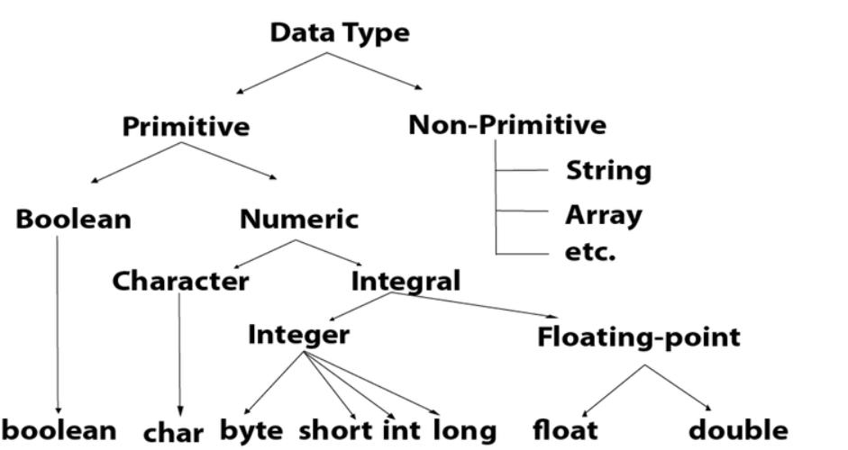
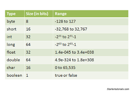
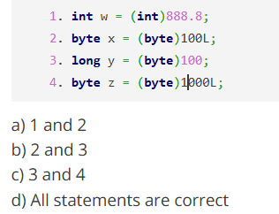
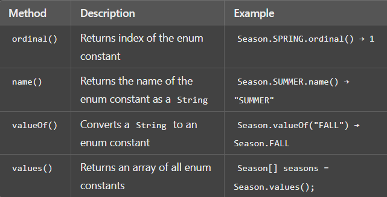

# History
Java is an Object-Oriented programming language developed by James Gosling in the early 1991.
The language was originally called Oak, but was later renamed to Java in 1994 and in 1994 it is publiched
<br/>
<br/>

# Datatypes 
## 1. Primitive Datatypes
Primitive data types are the building blocks of data manipulation.

> [!NOTE]
> No. of Primitive data types : 8


## 2. Non-Primitive Datatypes
Non-primitive data types are the complex data types that are used to store multiple values.
<br/>
Ex :- Arrays, ArrayList, HashMap, Class, Interface etc.


<br/>
> [!NOTE]
> Formula of calculate the range by using the size.<br/>
 -2^(8-1) to 2^(8-1)-1





> [!NOTE]
> Automatic type conversion is possible in which of the cases <br/>
> -> int to long

It will be understand by Ex : 
```
public class Solution{
    public static void main(String[] args){
        short x = 10;
        x =  x * 5;
        System.out.print(x);         -> Compile Error
    }
}
```

## Integer and Float

## Q1

 
Answer :- d <br/>
Explanation: Statements (1), (2), (3), and (4) are correct. (1) is correct because when a floating-point number (a double in this case) is cast to an int, it simply loses the digits after the decimal. (2) and (4) are correct because a long can be cast into a byte. If the long is over 127, it loses its precision due to narrowing of the conversion. (3) actually works, even though a cast is not necessary, because a long can store a byte.


> An expression involving byte, int, and literal numbers is promoted to which of these? <br>
Answer :- int

> Which data type value is returned by all transcendental math functions? <br/>
> Answer :- double

<br>
What is output

```
class output {
        public static void main(String args[]) 
        {
            double a, b,c; 
            a = 3.0/0;   -> Infinity
            b = 0/4.0;   -> 0.0
            c=0/0.0;     -> NaN
 
	        System.out.println(a);
            System.out.println(b);
            System.out.println(c);
        } 
    }
```

## Character and Boolean

> Which of these coding types is used for data type characters in Java? <br>
Answer :- UNICODE

```
3. Which of these values can a boolean variable contain?
a) True & False
b) 0 & 1
c) Any integer value
d) true

Ans :- true
```

```
Which one is a valid declaration of a boolean?
a) boolean b1 = 1;
b) boolean b2 = ‘false’;
c) boolean b3 = false;
d) boolean b4 = ‘true’
Ans :- c
```

The **ASCII** (American Standard Code for Information Interchange) values for uppercase letters A to Z range from 65 to 90, and the values for lowercase letters a to z range from 97 to 122.

## '&' (bitwise AND operator) <br>
-> It compares each bit of the first operand to the corresponding bit of the second operand. <br>
-> It returns true when both the values are true and false otherwise. Since, var1 is defined true and var2 is defined false hence their ‘&’ operator result is false.


## Enum
Enums are used to define a set of named constants, providing a way to represent a fixed set of values.



```
Can we create an instance of Enum inside the Enum itself?
a) True
b) False
Ans :- False
```

```
 enum Season 
    {
        WINTER, SPRING, SUMMER, FALL
    };
    System.out.println(Season.WINTER.ordinal()); -> 0
```

```
class A
{
 
}
 
enum Enums extends A
{
    ABC, BCD, CDE, DEF;
}

a) Runtime Error
b) Compilation Error
c) It runs successfully
d) EnumNotDefined Exception

Ans :- b (syntax error)
```

> [!TIP]
>Enum cannot use any modifiers before the values. They are public, static and final by default.

> [!TIP]
> Syntax wrong means compilation error 

```
enum Enums
{
    A, B, C;
 
    private Enums()
    {
        System.out.println(10);
    }
}
 
public class MainClass
{
    public static void main(String[] args)
    {
        Enum en = Enums.B;
    }
}

Ans :- 10 10 10
```

**getEnumConstants()** returns the elements of this enum class or null if this Class object does not represent an enum type.

## BigDecimal


BigDecimal has unnatural syntax, needs more memory and creates a great amount of garbage. But it has a high precision which is useful for some calculations like money.

```
double a = 0.02;
   double b = 0.03;
   double c = b - a;
   System.out.println(c);
 
   BigDecimal _a = new BigDecimal("0.02");
   BigDecimal _b = new BigDecimal("0.03");
   BigDecimal _c = b.subtract(_a);
   System.out.println(_c);

   Ans :-   0.009999999999999998
            0.01
```

BigDecimal provides more precision as compared to double. Double is faster in terms of performance as compared to BigDecimal.

## Date and TimeZone

> [!NOTE]
> sdf.parse converts the String to Date object.
> sdf.format converts the Date object to String.

How to format date from one form to another?
```
Date now = new Date();
SimpleDateFormat sdf = new SimpleDateFormat ("yyyy-mm-dd'T'hh:MM:ss");
String nowStr = sdf.format(now);         -> date to String
System.out.println("Current Date: " + );
```

How to convert a String to a Date object?
```
SimpleDateFormat sdf = new SimpleDateFormat("yyyy-mm-dd");
sdf.parse(new Date());
```

SimpleDateFormat is not thread safe. In the multithreaded environment, we need to manage threads explicitly.<br>
Java.sql.Date is the datatype of Date stored in database.

How to get difference between two dates?
> long diffInMilli = java.time.Duration.between(dateTime1, dateTime2).toMillis();

How to get UTC time?
> Instant.now();

## Literals & Variables
**Literals** in Java is a synthetic representation of boolean, numeric, character, or string data. 

```
Which of these is long data type literal?
a) 0x99fffL
b) ABCDEFG
c) 0x99fffa
d) 99671246

Answer: a
Explanation: Data type long literals are appended by an upper or lowercase L. 0x99fffL is hexadecimal long literal.
```

```
Which of these can be returned by the operator &?
a) Integer
b) Boolean
c) Character
d) Integer or Boolean

Answer: d
Explanation: We can use binary ampersand operator on integers/chars (and it returns an integer) or on booleans (and it returns a boolean).
```

```
 Which of these can not be used for a variable name in Java?
a) identifier
b) keyword
c) identifier & keyword
d) none of the mentioned

Answer: b
Explanation: Keywords are specially reserved words which can not be used for naming a user defined variable, example: class, int, for etc.
```

## Type Conversion and Casting

```
4. If an expression contains double, int, float, long, then the whole expression will be promoted into which of these data types?
a) long
b) int
c) double
d) float

Answer: c
Explanation: If any operand is double the result of an expression is double.
```

**Truncation** -> Truncate means to trim some digits of a floating type number or a double type number from right. We can also truncate the decimal portion completely making it an integer type number.

> [!NOTE]
>  Operator ++ increments the value of character by 1.

### Q
What will be the output of the following Java code?

```
class conversion 
{
    public static void main(String args[]) 
    {
        double a = 295.04;
        int  b = 300;
        byte c = (byte) a;
        byte d = (byte) b;
        System.out.println(c + " "  + d);
    } 
}

a) 38 43
b) 39 44
c) 295 300
d) 295.04 300

Answer: b
Explanation: Type casting a larger variable into a smaller variable results in modulo of larger variable by range of smaller variable. b contains 300 which is larger than byte’s range i:e -128 to 127 hence d contains 300 modulo 256 i:e 44.
output:

```

What will be the output of the following Java code?
```
class A 
{
    final public int calculate(int a, int b) { return 1; } 
} 

class B extends A 
{ 
    public int calculate(int a, int b) { return 2; } 
} 

public class output 
{
    public static void main(String args[]) 
    { 
        B object = new B(); 
        System.out.print("b is " + b.calculate(0, 1));  
    } 
}


Answer : Compilation Error
Explanation: The code does not compile because the method calculate() in class A is final and so cannot be overridden by method of class b.
```

> [!NOTE]
> Final method cannot be overridden

## Arrays

int[] arr = new arr[2]; <br>
2 is the size of the array

### Arrays method

1. Convert Array to String (**toString()**)
```
int[] numbers = {1, 2, 3, 4, 5};
System.out.println(Arrays.toString(numbers)); 
// Output: [1, 2, 3, 4, 5]
```
2. Sort an Array (**sort()**)
```
int[] numbers = {5, 3, 8, 1, 2};
Arrays.sort(numbers);
Arrays.sort(numbers, 1, 4);      // Sorts elements from index 1 to 3
```

> [!NOTE]
> The **Arrays.sort()** method in Java uses **Dual-Pivot Quicksort** for sorting **primitive arrays** (e.g., int[], double[]) (worst time c. -> O(n^2)) and <br/> **TimSort** for sorting **object arrays** (e.g., String[], Integer[]) (worst time c. -> O(n log n) ) .

3. Fill an Array (fill())
```
int[] numbers = new int[5];
Arrays.fill(numbers, 10);             // Output: [10, 10, 10, 10, 10]
Arrays.fill(numbers, 1, 4, 20);       // Output: [10, 20, 20, 20, 10]
```

4. Copy an Array (copyOf(), copyOfRange())
```
int[] numbers = {1, 2, 3, 4, 5};
int[] copiedArray = Arrays.copyOf(numbers, numbers.length);       // Output: [1, 2, 3, 4, 5]
int[] subArray = Arrays.copyOfRange(numbers, 1, 4);               // Output: [2, 3, 4]
```

5. Compare Two Arrays (equals())
```
int[] arr1 = {1, 2, 3};
int[] arr2 = {1, 2, 3};
System.out.println(Arrays.equals(arr1, arr2));    // true
```


6. Search in an Array (binarySearch())
```
int[] numbers = {1, 2, 3, 4, 5};
int index = Arrays.binarySearch(numbers, 3);
```

7. Convert an Array to a List (asList())
```
String[] fruits = {"Apple", "Banana", "Cherry"};
List<String> fruitList = Arrays.asList(fruits);
```

8. Create a Parallel Sorted Array (parallelSort())

Introduced in Java 8 uses a combination of Merge Sort and Fork/Join parallelism.<br>
Works by dividing the array into subarrays, sorting them in parallel threads, and then merging the results. <br>
Faster than Arrays.sort() for large datasets (typically above 10,000 elements). <br>
**Time Complexity**: O(n log n)


What will be the output of the following Java code?
```
    int arr[] = new int [5];
    System.out.print(arr);

	a) 0
	b) value stored in arr[0]
	c) 00000
	d) Class name@ hashcode in hexadecimal form
```

Answer: d <br>
Explanation: If we trying to print any reference variable internally, toString() will be called which is implemented to return the String in following form:
classname@hashcode in hexadecimal form.

What will be the output of the following Java code?
```
    class array_output 
    {
        public static void main(String args[]) 
        {
            int array_variable [] = new int[10];
        for (int i = 0; i < 10; ++i) 
            {
                array_variable[i] = i;
                System.out.print(array_variable[i] + " ");
                i++;
            }
        } 
    }

    a) 0 2 4 6 8
    b) 1 3 5 7 9
    c) 0 1 2 3 4 5 6 7 8 9
    d) 1 2 3 4 5 6 7 8 9 10


    Answer: a
```


